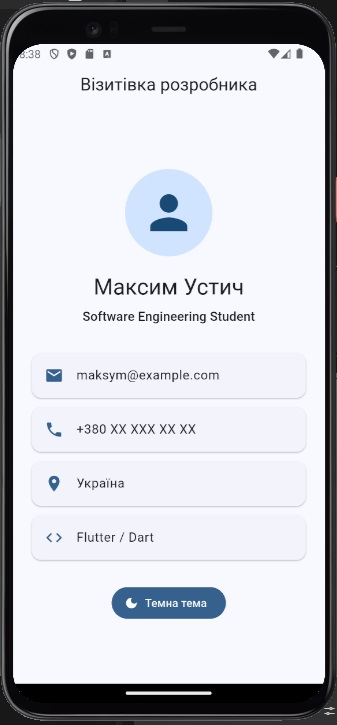
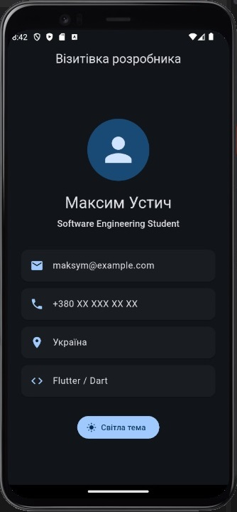
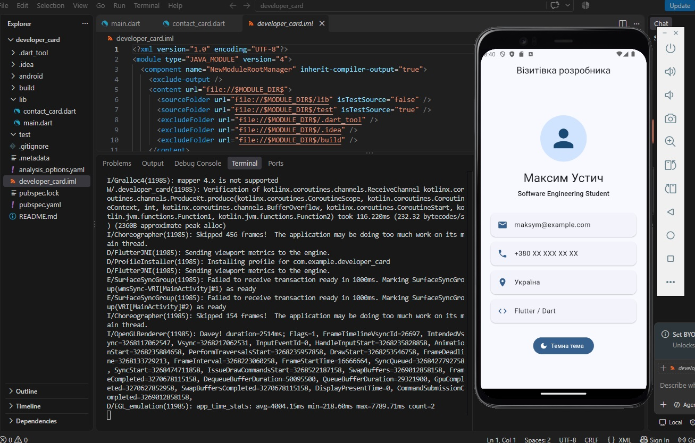
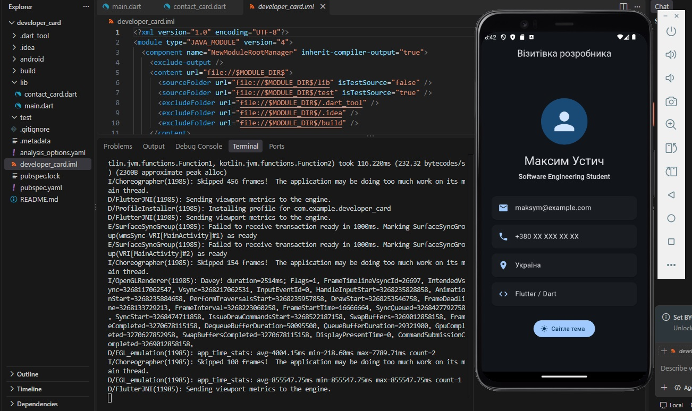
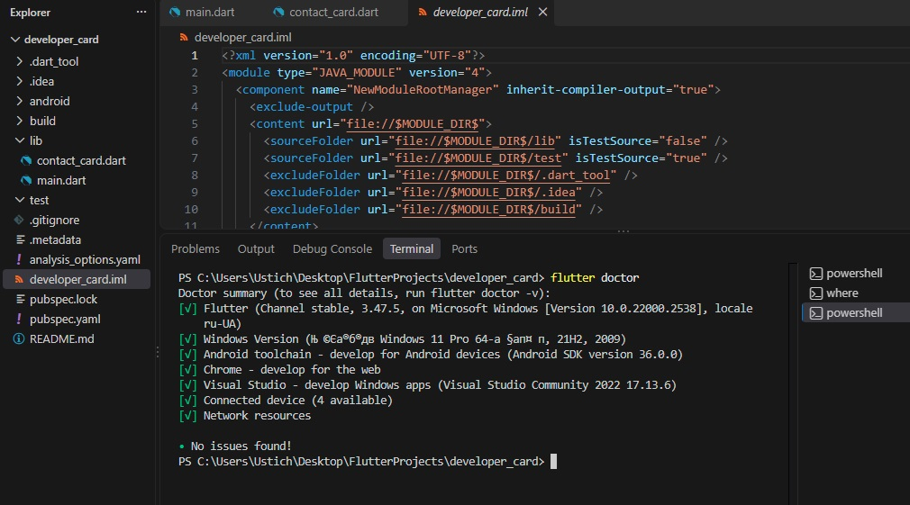

# Практична робота 3: Hello World в Flutter

## Варіант 1 — Візитівка розробника

У межах практичної роботи створено односторінковий Flutter-застосунок «Візитівка розробника».

Застосунок містить:
- аватар користувача;
- ім'я та спеціальність;
- список контактів;
- кнопку перемикання світлої та темної теми;
- збереження стану теми у StatefulWidget;
- окремий віджет ContactCard у файлі `contact_card.dart`.

## Структура проєкту

Основний код розміщено у папці `lib`:

- `main.dart` — основний екран застосунку та логіка перемикання теми;
- `contact_card.dart` — окремий віджет для відображення контактів.

## Запуск проєкту

1. Встановити Flutter SDK та Android Studio.
2. Перевірити середовище командою:

```bash
flutter doctor
```

3. Відкрити проєкт у VS Code.
4. Запустити Android-емулятор.
5. У терміналі виконати:

```bash
flutter pub get
flutter run
```

## Перевірка коду

Перед запуском виконано:

```bash
flutter analyze
```

Результат:

```text
No issues found!
```

## Hot Reload / Hot Restart

Під час роботи використовувались можливості Flutter Hot Reload та Hot Restart.

Hot Reload дозволяє швидко застосовувати зміни у коді без повного перезапуску застосунку та зберігає поточний стан.

Hot Restart повністю перезапускає застосунок і повторно ініціалізує його стан.

## Труднощі під час виконання

Під час налаштування середовища виникли труднощі з Android SDK, Android NDK та запуском емулятора.

Для розв'язання проблем:
- було встановлено Android Studio;
- налаштовано Android SDK;
- встановлено Android SDK Command-line Tools;
- встановлено необхідну версію Android NDK;
- налаштовано та запущено Android-емулятор.

Після цього застосунок успішно зібрано та запущено.

## Скріншоти

### Світла тема



### Темна тема



### Запуск у VS Code





### Flutter Doctor

